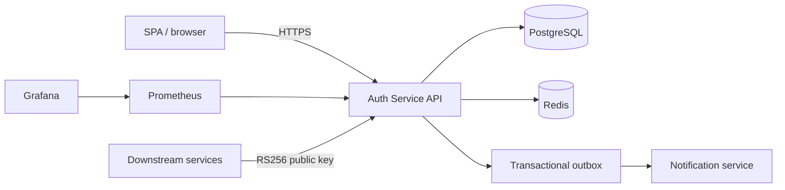

# Auth Service

Auth Service solves the common problem of giving an application a secure, observable authentication boundary with sessions, permissions, and recoverable email delivery.

> This is a learning/demo project. Do not use real passwords, OAuth credentials, SMTP credentials, signing keys, or production user data in the local stack.

## Capabilities

Implemented:

- RS256 access JWTs, short-lived access tokens, refresh-token rotation, reuse detection, logout, and session revocation.
- Registration, email confirmation, password reset, lockout protection, generic enumeration-safe responses, and Google OAuth when configured.
- Role/permission authorization, admin role mapping, audit events, transactional outbox, and failed-outbox query.
- Redis-backed distributed limits, PostgreSQL persistence, OpenTelemetry, Prometheus metrics, Grafana dashboard, JSON logs, health checks, and CI checks.

Planned:

- MFA/WebAuthn, BFF deployment mode, automated JWT key rotation, production notification-service receiver, and higher coverage thresholds.

## Architecture



See [architecture overview](docs/Architecture.md) and [detailed diagrams](docs/ArchitectureDiagrams.md).

## Stack

| Component | Why it is used |
|---|---|
| .NET 9 / ASP.NET Core | API host, Identity, authentication middleware, health checks. |
| PostgreSQL + EF Core | Durable identity, session, audit, and outbox data with migrations. |
| Redis | Distributed abuse-protection limits and readiness check. |
| OpenTelemetry + Prometheus + Grafana | Traces and actionable local API/outbox metrics. |
| Testcontainers | Integration tests against disposable PostgreSQL and Redis containers. |

## Requirements

- .NET SDK 9
- Docker Desktop with Docker Compose v2
- Optional: GNU Make, `k6` for load tests

## Local development

Start the minimal stack (API, PostgreSQL, Redis, Mailpit):

```bash
docker compose up --build -d
docker compose ps
curl --fail http://localhost:5000/health/ready
```

Useful local URLs:

| Service | URL |
|---|---|
| Scalar / OpenAPI UI (Development only) | http://localhost:5000/scalar |
| OpenAPI document (Development only) | http://localhost:5000/openapi/v1.json |
| Mailpit | http://localhost:8025 |
| Prometheus profile | http://localhost:9090 |
| Grafana profile | http://localhost:3000 (`admin` / `admin`, local only) |

Enable observability services:

```bash
docker compose --profile observability up --build -d
```

Stop services while retaining data, or reset only named Docker volumes:

```bash
docker compose down
docker compose down -v
```

The equivalent shortcuts are `make up`, `make up-observability`, `make health`, `make logs-api`, `make reset`, and `make help`.

### Environment variables

Copy `.env.example` to `.env` for local non-secret overrides. Never commit `.env`.

| Variable | Required | Safe example | Notes |
|---|---|---|---|
| `POSTGRES_PASSWORD` | Local optional | `local-only-change-me` | Compose has a development fallback. |
| `ConnectionStrings__DB_CONNECTION` | Outside Docker / production | `Host=localhost;Port=5435;Database=authdb;Username=postgres;Password=local-only-change-me` | Required for API and EF design-time commands. |
| `Redis__Configuration` | Outside Compose | `localhost:6390,abortConnect=false` | Redis endpoint. |
| `JwtSettings__PrivateKey` / `JwtSettings__PublicKey` | Production | `-----BEGIN ... KEY-----` | Store only in secret storage. Development generates ephemeral keys if absent. |
| `Audit__HashKey` | Outside Development | `replace-with-32-or-more-random-bytes` | Required in Production for HMAC-hashed audit IPs. |
| `Authentication__Google__ClientId` / `Authentication__Google__ClientSecret` | Optional | `demo-client-id` / `demo-secret` | Leave empty to disable Google OAuth. |
| `REVERSE_PROXY_IP` | Production Compose | `10.0.0.10` | Trust forwarded headers only from this proxy; never use a public CIDR. |

### Migrations

In Development the API applies migrations automatically when `Database:ApplyMigrations` is `true`. For explicit EF Core commands, provide a connection string first:

```powershell
$env:ConnectionStrings__DB_CONNECTION = 'Host=localhost;Port=5435;Database=authdb;Username=postgres;Password=local-only-change-me'
dotnet ef migrations add MeaningfulMigrationName --project AuthService.Api/AuthService.Api.csproj --startup-project AuthService.Api/AuthService.Api.csproj
dotnet ef database update --project AuthService.Api/AuthService.Api.csproj --startup-project AuthService.Api/AuthService.Api.csproj
```

`make migrate-add NAME=MeaningfulMigrationName` and `make migrate-update` provide the same commands.

## Auth flow

1. Login returns an access JWT in JSON and sets the refresh token only as an `HttpOnly`, `Secure`, `SameSite=Strict` cookie.
2. `POST /api/v1/auth/refresh` rotates that cookie and returns a new access token.
3. Reuse of a rotated refresh token revokes its session family and emits audit/metric signals.
4. OAuth redirects never put access or refresh tokens in the URL; the SPA calls `/api/v1/auth/refresh` after the redirect.

Use only placeholders from [sample HTTP requests](examples/AuthService.http). The file contains no credentials or real tokens.

## Tests and quality checks

```bash
dotnet test AuthService.UnitTests/AuthService.UnitTests.csproj
dotnet test AuthService.IntegrationTests/AuthService.IntegrationTests.csproj
k6 run -e BASE_URL=http://localhost:5000 -e AUTH_EMAIL=user@example.test -e AUTH_PASSWORD='replace-me' loadtests/auth-flow.js
make pre-commit
```

Integration tests start PostgreSQL and Redis through Testcontainers. CI verifies formatting, build, unit/integration tests, a unit coverage baseline, dependency review, secret scanning, image scanning, and migration-model consistency. See [CI/CD](docs/CiCd.md) and [load-testing notes](docs/LoadTesting.md).

## Observability

Start the observability profile and open the local [Grafana dashboard](http://localhost:3000). It includes API p95/5xx/401/403/429, database latency, refresh reuse, and outbox backlog/lag. Default Grafana credentials are for local development only.

## Key decisions

- **Token rotation:** access JWTs are short-lived; refresh tokens are one-time and reuse revokes the family.
- **Transactional outbox:** email events are committed with the business transaction, retried with backoff, and delivered at least once; receivers deduplicate `messageId`.
- **Permissions:** authorization is policy/permission-based rather than role-name checks in controllers.
- **Data privacy:** audit IPs use HMAC, raw credentials/tokens are excluded from logs and audit metadata, and retention is documented.

See [security design](docs/SecurityDesign.md), [audit taxonomy](docs/AuditEvents.md), [JWT-signing ADR](docs/adr/0001-jwt-signing.md), and [SPA token-storage ADR](docs/adr/0002-spa-token-storage.md).

## Known limitations and next steps

- MFA/WebAuthn and a BFF option are not implemented.
- JWT key rotation is manual; automated rotation and public key distribution are future work.
- The Notification Service is represented by a transport contract; a real receiver must deduplicate outbox `messageId` values.
- Coverage is guarded at 10% and should be raised as critical flows gain tests.
- Deployment templates are inactive until a real target is selected; see [deployment templates](docs/DeploymentTemplates.md).

## Security and license

See [SECURITY.md](SECURITY.md) for responsible disclosure. This project is licensed under the [MIT License](LICENSE).
