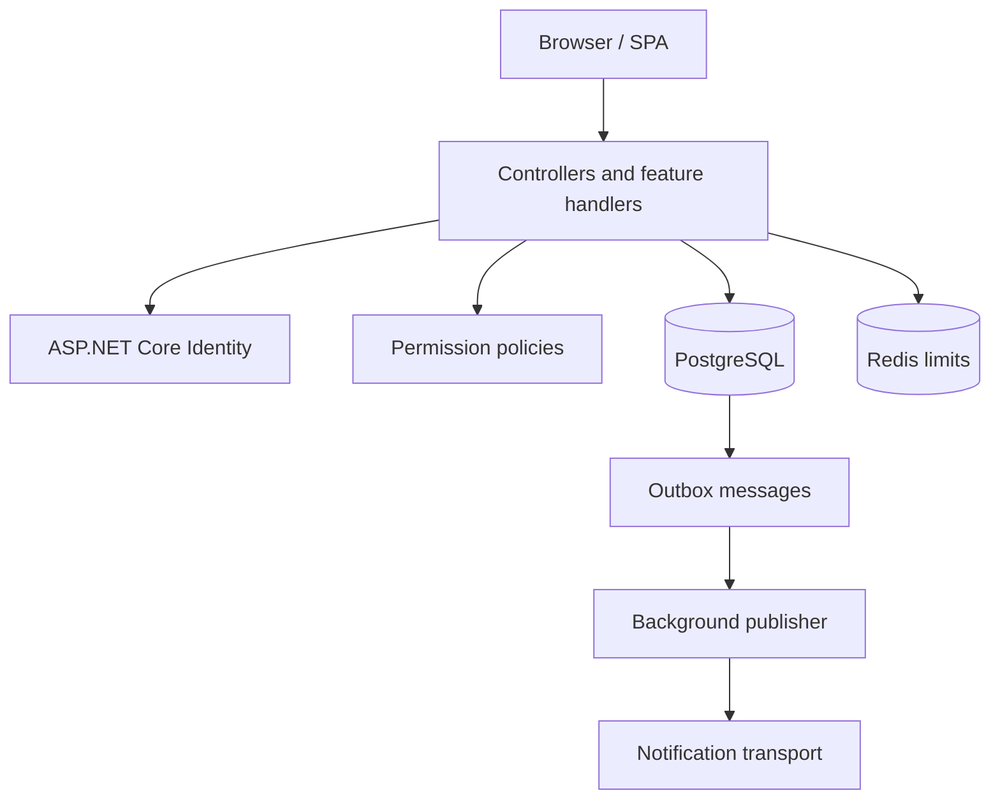

# Architecture overview

Auth Service is a modular ASP.NET Core API. Feature handlers contain use-case logic; infrastructure provides persistence, security integrations, rate limiting, and background processing.

PostgreSQL is the source of truth for users, sessions, refresh tokens, audit events, and outbox messages. Redis is intentionally an availability-tolerant abuse-protection dependency rather than an authorization source of truth.

For entity relationships and refresh-token sequence details, see [ArchitectureDiagrams.md](ArchitectureDiagrams.md).
