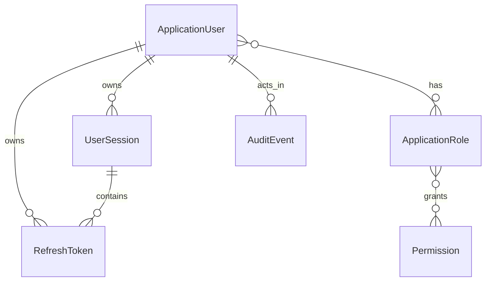
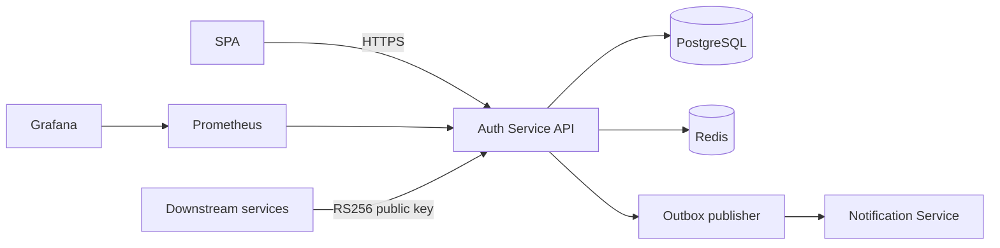
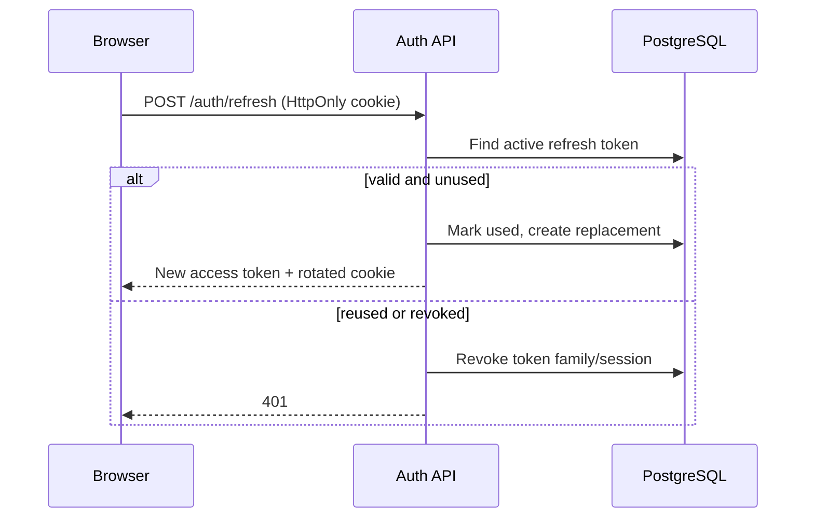

# Architecture diagrams

## ER diagram

```mermaid
erDiagram
    ApplicationUser ||--o{ UserSession : owns
    ApplicationUser ||--o{ RefreshToken : owns
    ApplicationUser }o--o{ ApplicationRole : has
    ApplicationRole }o--o{ Permission : grants
    UserSession ||--o{ RefreshToken : contains
    ApplicationUser ||--o{ AuditEvent : acts_in
```

## Component diagram

```mermaid
flowchart LR
    SPA[SPA] -->|HTTPS| API[Auth Service API]
    API --> PG[(PostgreSQL)]
    API --> Redis[(Redis)]
    API --> Outbox[Outbox publisher]
    Outbox --> Notification[Notification Service]
    Prometheus --> API
    Grafana --> Prometheus
    Services[Downstream services] -->|RS256 public key| API
```

## Refresh sequence

```mermaid
sequenceDiagram
    participant B as Browser
    participant A as Auth API
    participant D as PostgreSQL
    B->>A: POST /auth/refresh (HttpOnly cookie)
    A->>D: Find active refresh token
    alt valid and unused
        A->>D: Mark used, create replacement
        A-->>B: New access token + rotated cookie
    else reused or revoked
        A->>D: Revoke token family/session
        A-->>B: 401
    end
```
